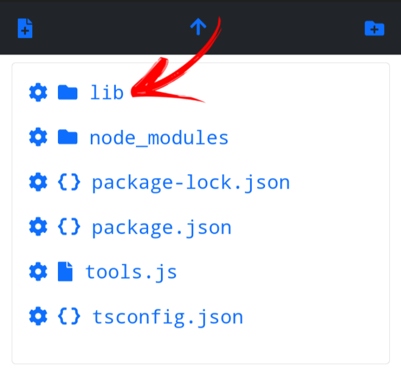
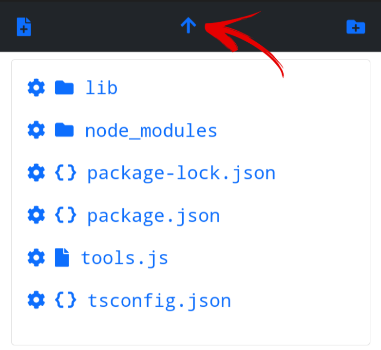
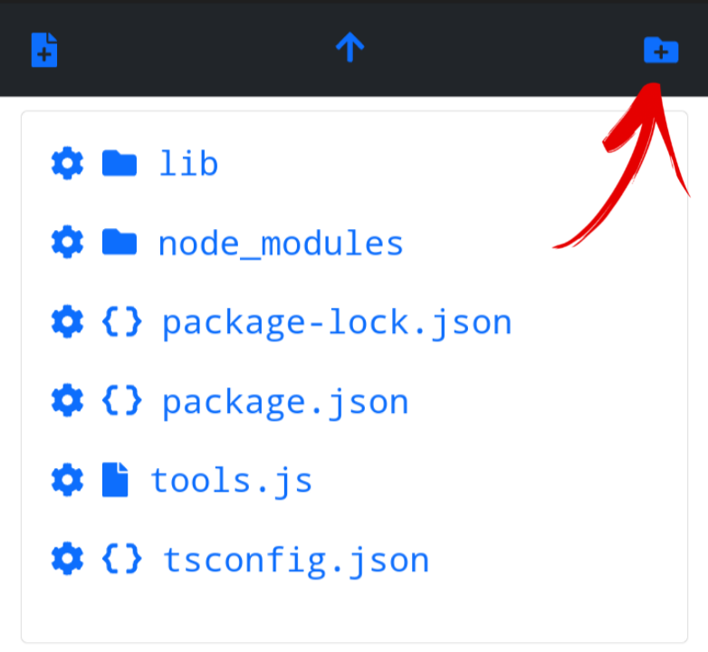
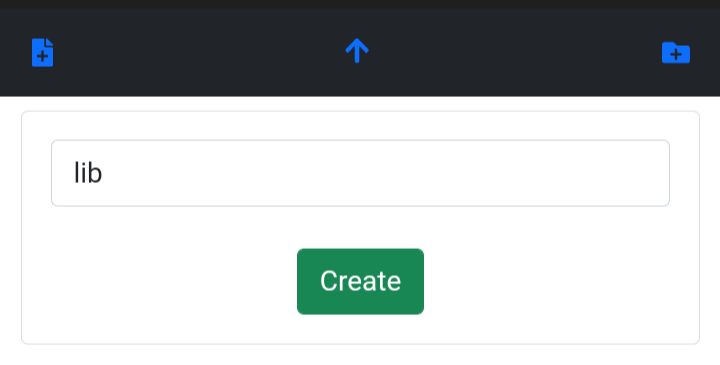
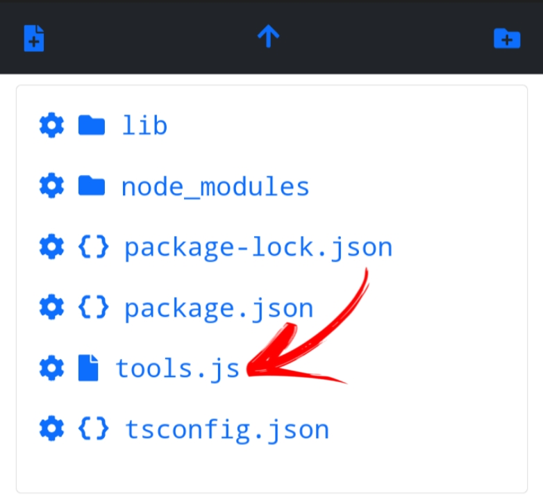
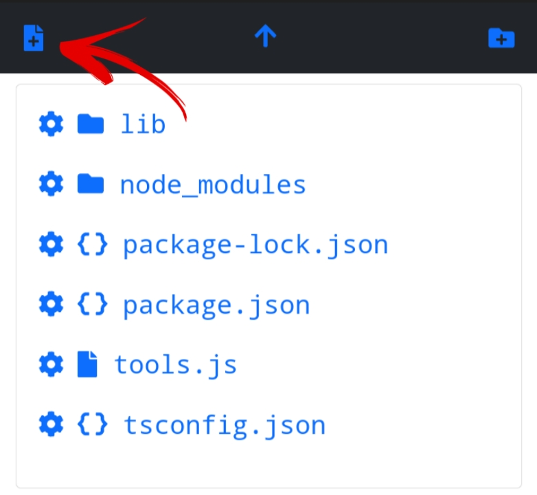
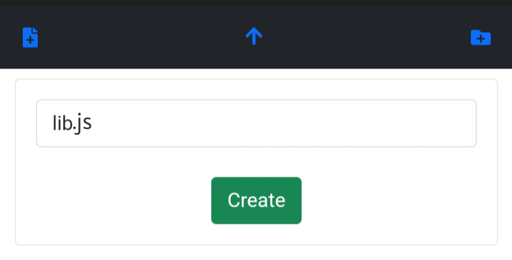

# getting-started

# the browse mode

- the browse mode allow you to navigate dir create files rename files and etc...

- how to setup browse mode
- first we have to config
- app.js example

```js
const express = require("express");
const { browse, browseView } = require("@otoniel19/file-explorer");
const bodyParser = require("body-parser");
const { engine } = require("express-handlebars");

const app = express();

app.use(bodyParser.json());
app.use(bodyParser.urlencoded({ extended: false }));
app.set("views", browseView); // the views

app.set("view engine", "handlebars");
app.engine("handlebars", engine({ defaultLayout: "main" }));

//config
browse.config("./", "../", false, "/files");
//route
app.use("/files", browse.router); //the route has to be the same as the configuration

app.listen(PORT);
```

# config params

```ts
 function config(
   //the initial dir to browse
   dir: string;
   //the root dir to catch errors when readdir fail
   root: string;
   //show hidden files
   hidden: boolean;
   //url to use
   url: string;
 )
```

# about config

**the route needs to be the same as the url param**

# using file-explorer

# folder methods

- open a folder
  
- click on the name of the folder to open

- leave a folder
  
- click the arrow in the menu to leave

- create folder
  
- click the folder icon on the menu

  

- input foldername and then click the "Create" button

# file methods

- open file
  

- click the filename to open

- create file
  

- click the file icon on the menu

  

- input filename and then click "Create" button

# files config

- to open config click on the cog icon

# the select mode

- coming soon

# thats all for now bye

**made by otoniel19 with ❤**
